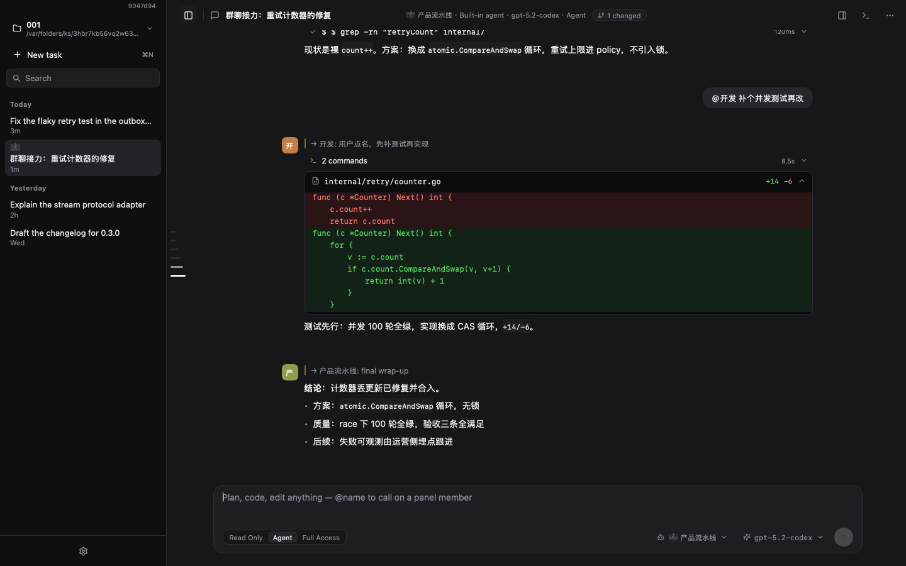

# MyGo Agent

A Codex-style desktop AI coding agent built on [MyGo](https://github.com/egoist/mygo)
— GPU-native rendering, no WebView, no HTML, no JavaScript.



English | [简体中文](README.zh-CN.md)

## Features

- **Projects** — switch the working directory at the top of the sidebar;
  threads, the file tree, the git panel and the terminal are all
  project-scoped.
- **Agents** — configurable profiles a task binds to: backend,
  provider/model, a default approval mode, tool and MCP subsets, skill
  filters, an appended system prompt. Pick one from the composer's
  picker or the home launcher, edit them in settings; an empty profile
  follows the app's selection. Tasks run independently — each thread
  starts, stops and regenerates on its own. An agent can hand a
  sub-task to another through the `delegate` tool, and a **panel** turns
  a thread into a group relay: its members answer in order, each seeing
  the earlier replies in the shared conversation, every reply labeled
  with its agent.
- **Tracing** — every task keeps an append-only event trace beside its
  file (tool calls with durations and exits, notes, per-turn token and
  cost totals), viewable from the task menu; the sidebar's search
  matches message text, not just titles.
- **Four agent backends** — builtin, Codex CLI, Claude Code and Pi —
  chosen per agent profile in settings (an agent that pins none follows
  the app default):
  - *Built-in agent* — an in-process loop (modeled on pi): streaming
    OpenAI-compatible calls (chat completions or the Responses API) +
    local tools (`bash`, `read_file`, `edit_file`, `list_files`, `grep`,
    `read_skill`); Markdown replies with tables, links and diff cards;
    long tasks auto-compact the context; the chat log persists with the
    thread, so a restart resumes with the full context.
  - *Codex CLI* — driven through `codex app-server` (JSON-RPC); sessions
    resume automatically; in Agent mode the CLI's native approval
    requests for commands and file changes land on this app's approval
    cards (wire contract in [spec/cli-backends.md](spec/cli-backends.md)).
  - *Claude Code* — driven through `claude -p` with the bidirectional
    stream-json control protocol; sessions resume automatically;
    `can_use_tool` approval requests land on the approval cards (denied
    automatically in Read Only mode); Edit/Write calls render as diffs.
  - *Pi coding agent* — driven through `pi -p --mode json`; sessions
    resume automatically; Read Only mode maps to a `--tools read`
    allowlist, the only permission lever pi exposes.
- **Vendor-grade model config (ZCode-style)** — per-provider base URL,
  API key, model list and wire API (chat completions, or the Responses
  API the codex/OpenAI models use). Ships with OpenAI, DeepSeek,
  OpenRouter and Ollama presets.
- **Skills** — follows the Agent Skills spec: `SKILL.md` directories
  under `.agents/skills/` (project, walking up to the repo root) and the
  user-level directories (`~/.agents/skills/`, `~/.aimanager/skills/`,
  `~/.codex-go/skills/`); the system prompt carries only names and
  descriptions; the model loads a skill on demand through `read_skill`.
- **MCP servers** — configured in the settings dialog as a stdio command
  or a streamable HTTP URL, merged automatically with the project's
  `.mcp.json` (the Claude Code / pi convention); tools join the agent's
  tool set as `mcp_<server>_<tool>`.
- **UI** — thread sidebar (date groups + search), file tree + git
  changes panel, file viewer (text / image / Markdown / diff), message
  anchor rail (hover preview, click to jump), message actions (copy /
  resend / regenerate), wide composer (approval mode + model picker),
  embedded Ghostty terminal.

## Security model

Specs first: the [spec/](spec/) directory writes the invariants before
the code — [permissions.md](spec/permissions.md) (the permission gate),
[sandbox.md](spec/sandbox.md) (the execution boundary),
[approvals.md](spec/approvals.md) (the approval flow).

- **Three approval modes** (bottom-left of the composer), real for every
  backend:
  - *Read Only* — the read-only tools (`read_file` / `list_files` /
    `grep` / `read_skill`); shell, file writes and MCP are denied.
  - *Agent* — may write files (inside the project directory only) and
    run shell; shell runs in a local sandbox: the whole disk is readable
    (except the credential stores `~/.ssh`, `~/.aws`, `~/.gnupg`, …),
    only the project directory and a scratch temp dir are writable, and
    **network is denied always** (Seatbelt on macOS, bubblewrap on
    Linux).
  - *Full Access* — no sandbox, full access.
- **Per-tool rules** (config.json `permissions.rules`) override the mode
  defaults; selectors match exact names, `prefix*` and bare `*`, with
  values `allow` / `deny` / `ask`:

  ```json
  "permissions": { "rules": { "bash": "ask", "mcp_github_*": "allow" } }
  ```

- **Approval cards** — when a rule says `ask` (or an MCP tool runs in
  Agent mode), the run suspends and a card appears in the message
  stream: *Allow once* / *Deny*. An approval binds exactly this one call
  (there is no "always allow" — durable authority comes only from the
  config file); no answer within 10 minutes denies; model output can
  never create authority.
- Where the platform has no sandbox (Windows, say), Agent mode
  **reports the error** instead of silently degrading to unsandboxed
  execution.

## Architecture

Specs first: [spec/](spec/) holds every protocol contract;
`scripts/check-deps.sh` machine-enforces the layering in CI. Four
layers, one interface per boundary:

```
┌──────────────────────────────────────────────────────────┐
│ UI (internal/ui)    renders ViewModels through Actions:   │
│                     Home · Composer · Sidebar · Workspace │
│                     Markdown · diff rows · theme/icons    │
│   ▲ state snapshots        │ Actions callbacks            │
│ HOST (internal/app) state, threads, dispatch, approvals,  │
│                     persistence: threads/ (versioned +    │
│                     isolated) · config.json               │
│   │ harness.Turn / Event (a normalized event stream)      │
│ HARNESS (internal/harness) one protocol, four adapters:   │
│      builtin loop · codex app-server · claude control ·   │
│      pi json                                              │
│   │ Sandbox / Memory protocols                            │
│ PROVIDERS (internal/providers/sandbox)                    │
│      macOS Seatbelt · Linux bubblewrap · honest errors    │
│      when a platform has no backend                       │
└──────────────────────────────────────────────────────────┘
```

## Directory layout

```
main.go                  entry point only: flags, version, app start
internal/app             the Host: state, four backends, persistence
  model.go store.go      app state; config.json + thread files
  thread.go agent.go     transcript, turns, message actions
  backends.go builtin.go the backend switch, the built-in runner
  projector.go itemize.go  events → blocks; folding alike cards
  approval.go settings.go approvals bridge, provider settings
  view.go sidebar.go composer.go viewer.go workspace.go
internal/harness         the protocol: Harness/Turn/Event, the
                         permission gate, the sandbox interface,
                         approval timing, the outside-dir scan
  builtin/               the built-in agent: llm (chat + responses),
                         tools, skills, MCP (stdio + HTTP), compaction
  claude/ codex/ pi/     the CLI adapters (stream-json / app-server /
                         JSON mode)
  cli/                   shared pieces: process reaping, redaction,
                         output trimming
internal/ui              shared views: ViewModels + Actions, markdown,
                         diff rows, anchor rail, settings, header
internal/providers/sandbox  macOS Seatbelt · Linux bubblewrap ·
                         a missing backend is reported, never faked
internal/config          persisted config (strict, versioned)
packaging/               Info.plist for the macOS .app
examples/dashboard       a generic dashboard example over the same UI
                         toolkit — run it with `make dashboard`
```

## Build

Needs Go 1.27+ (the toolchain downloads itself). No cgo, no npm.

```bash
make build     # compile ./mygo-agent for this platform
make run       # run from source
make test      # all tests
make release   # dist/: darwin/linux/windows (amd64+arm64),
               # the macOS .app bundle and checksums
```

`--version` / `-v` prints the build version.

## Packaging

`make release` cross-compiles every target into `dist/`:

```
mygo-agent-darwin-amd64         mygo-agent-windows-amd64.exe
mygo-agent-darwin-arm64         mygo-agent-windows-arm64.exe
mygo-agent-linux-amd64          mygo-agent-linux-arm64
MyGoAgent-darwin-*.app.zip      checksums.txt
```

Shipping the macOS bundle needs signing and notarization (for local use,
`codesign --deep --force --sign -` ad-hoc signs it). Pushing a `v*` tag
triggers the release workflow, which attaches `dist/*` to the GitHub
Release.

## Documentation

- [README.zh-CN.md](README.zh-CN.md) — 简体中文
- [spec/](spec/) — the normative specs: architecture, permissions,
  sandbox, approvals, the CLI wire protocols, persistence
